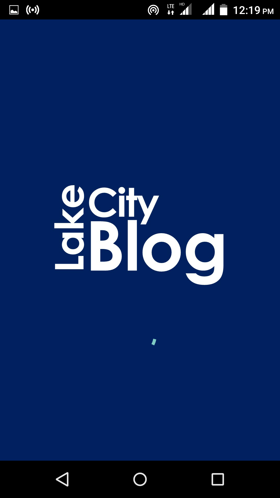
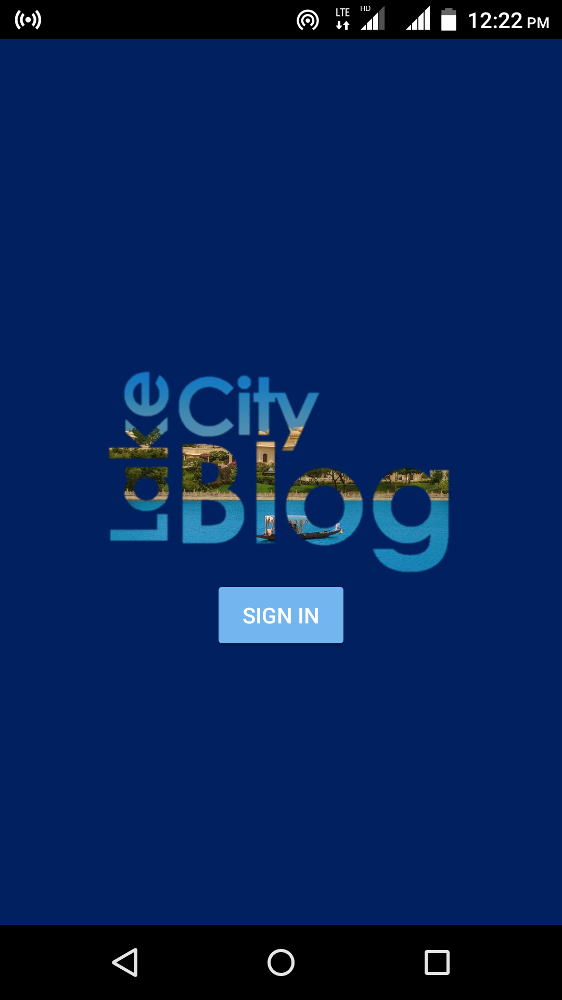
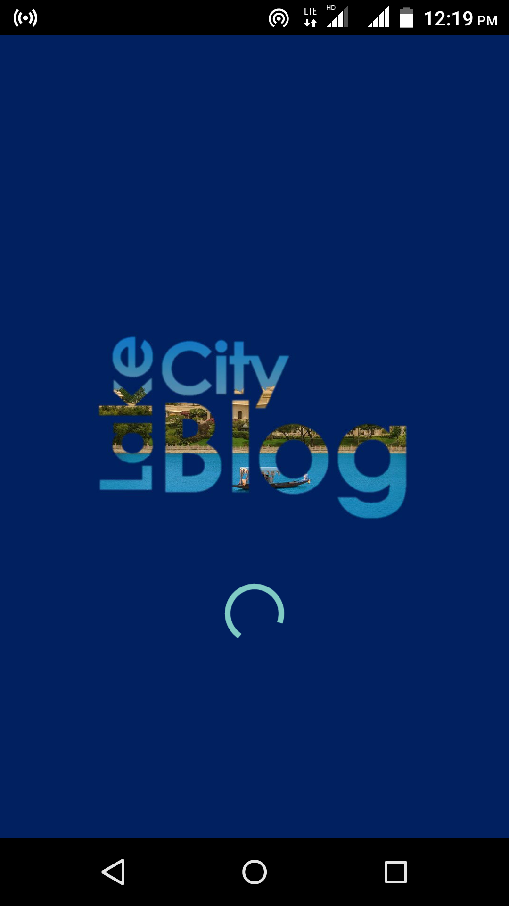
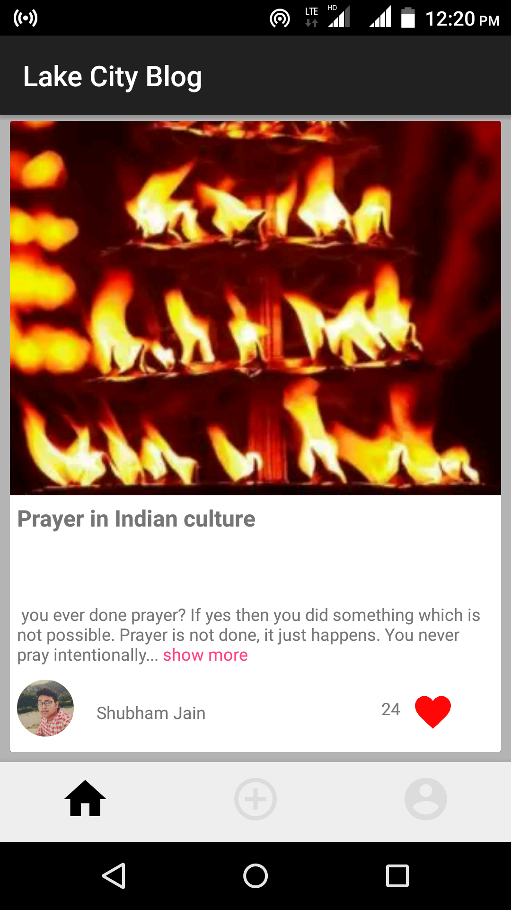
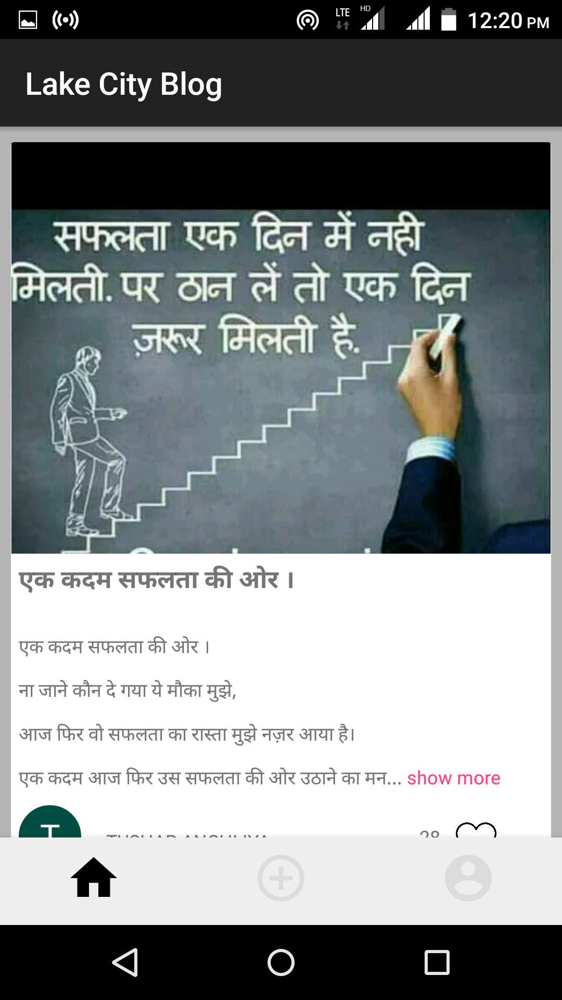
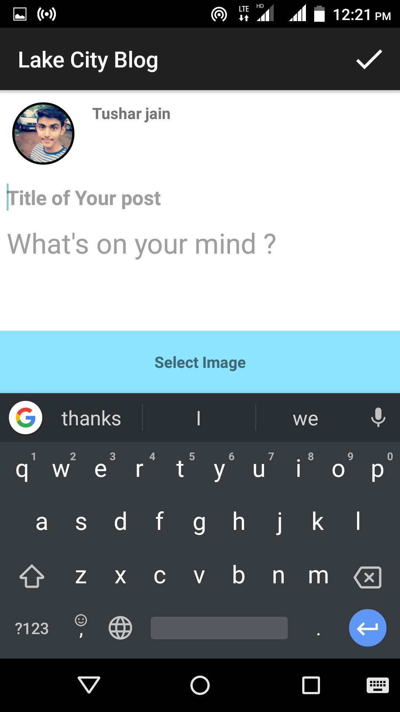

# UdaipurBlog

### What is Udaipur Blog   
This application is developed under Developer Student Club leading by [Akshay Nandwana](https://github.com/anandwana001). 
This Blog app is based on the open source Blog code from the github.com/DeveloperStudentClub-Udaipur/UdaipurBlog repository on GitHub.

### Features 

Universal: runs on Android 4.0+.

Uses Core Data to keep track of User's Blog.

Blog can be organised by latest post.

Localization ready.

Likes introduced.

Google sign-In.

Current development and testing of the Blog App is under Android studio 3.1.2, Android 4.0+ . 

### Screenshots

  

  

 

