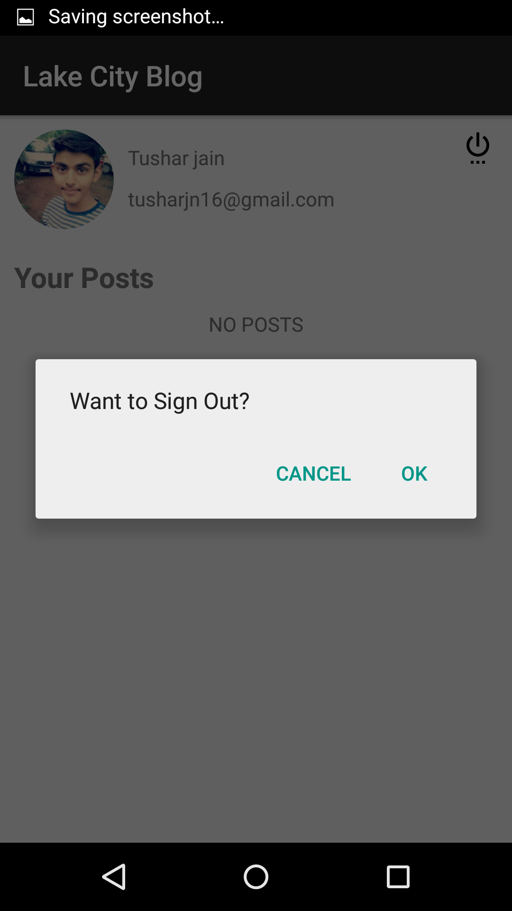

# UdaipurBlog

### What is Udaipur Blog
  
This Application is developed by the student members of the esteemed Developer Student Club (Udaipur) led by [Akshay Nandwana](https://github.com/anandwana001) , the LakecityBlog application is a simple blogging application. It was developed with the aim to provide a platform to the users to share their ideas , views , opinions and experiences through a blog.

The application was initially launched in our college during the annual technical fest , TechJalsa2k18. To engage the students , a small prize money was announced for the first three students who would come up with the best quality content. 
As a result , the application was successful in gaining more than a hundred followers. 

### Screenshots

   

 

  

